# Decantr — Assignment 2

## Table of Contents

1. [Customer Journeys](#customer-journeys)
   - [Wine Business Owner — Sophie Wagner](#wine-business-owner--sophie-wagner)
   - [Wine Enthusiast — Alex Chen](#wine-enthusiast--alex-chen)
2. [UML Class Diagram](#uml-class-diagram)

---

## Customer Journeys

Two customer journeys are described below. Each journey represents a customer segment: Sophie Wagner as a Wine Business owner (B2B), and Alex Chen as a Wine Enthusiast (B2C). Decantr responds to the different needs of both sides of the platform and helps them carry out their goals.

---

### Wine Business Owner — Sophie Wagner

Sophie Wagner is the 42-year-old owner of "Weinkultur," a boutique wine bar in Munich's Schwabing district. She holds a sommelier certification and hosts two to three tasting events per month. Despite her expertise, Sophie struggles with collecting structured feedback from guests — she currently uses paper forms that are tedious to analyze — and her marketing reach is limited to Instagram and a small mailing list. She heard about Decantr from a fellow bar owner at a wine fair and decides to try the platform.

---

#### Step 1: Registration & Subscription

| Mockup | Description |
|--------|-------------|
| 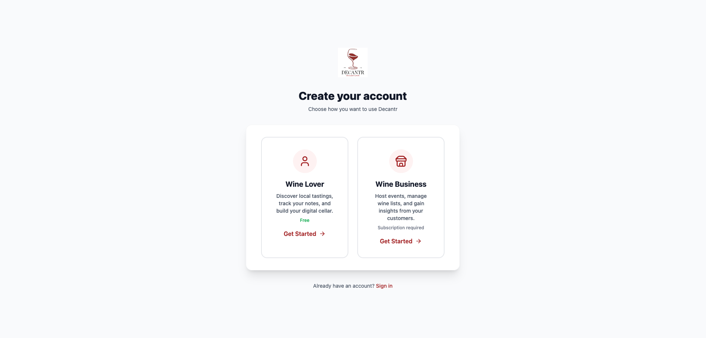 | Sophie navigates to the Decantr website and clicks "Sign up." On the registration page, she is presented with two clear options: "Wine Lover" (free) and "Wine Business" (subscription required). She selects "Wine Business," which takes her to the next step. |
| 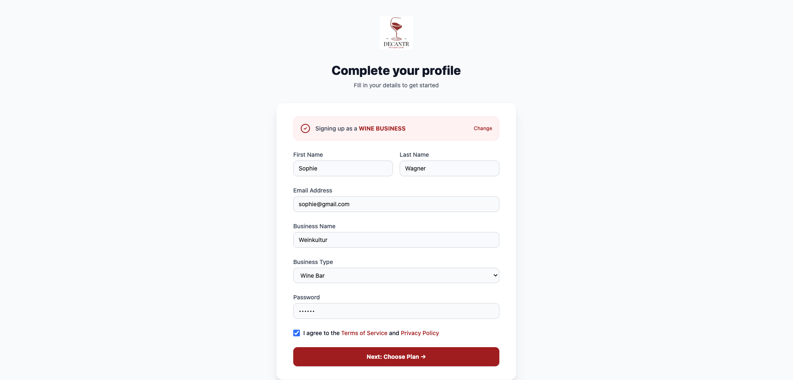 | She fills in her personal details — first name, last name, and email — along with her business information: "Weinkultur" as the business name and "Wine Bar" as the business type. After setting a password and agreeing to the terms of service, she clicks "Next: Choose Plan →." |
| 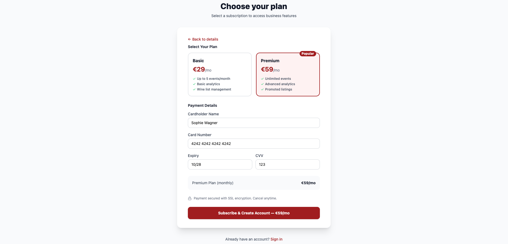 | Sophie is presented with two subscription plans: Basic (€29/mo) and Premium (€59/mo). She selects the Premium plan for unlimited events and advanced analytics. She enters her credit card details and clicks "Subscribe & Create Account." After payment processing, she is directed to her business dashboard. |

- **Frontend:** Registration form with role-based fields, multi-step flow, plan selection cards, payment form.
- **Backend:** POST `/api/auth/register` — Creates User + Business + Subscription documents. Payment processed via Stripe API. **Database: Create** User, Business, Subscription documents.

---

#### Step 2: Managing Wine Inventory

| Mockup | Description |
|--------|-------------|
| 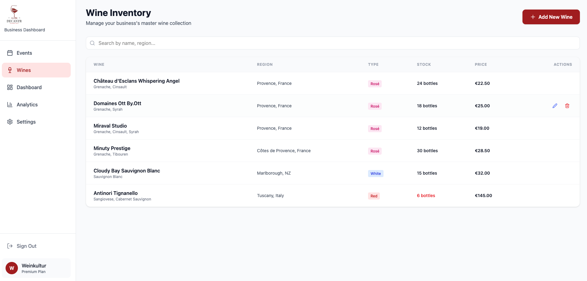 | Before creating events, Sophie first builds her wine inventory. She navigates to the "Wines" section in the sidebar and sees her existing collection displayed in a table: wine name (with grape variety), region, type (color-coded badges), stock count, and price. She can search and filter wines. |
| 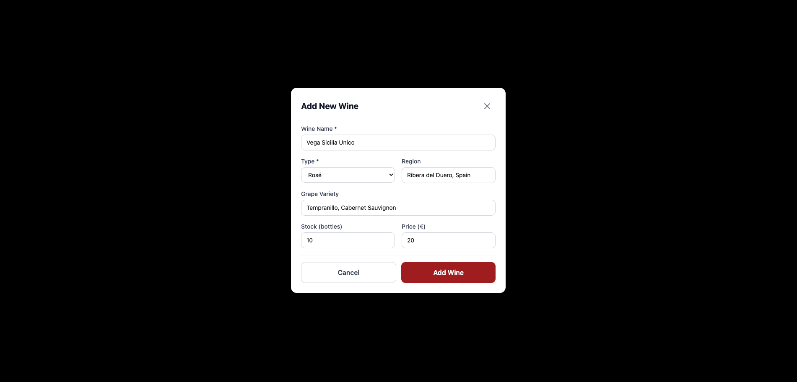 | Sophie clicks "Add New Wine" to expand her collection. A modal appears where she enters the wine name, type, region, grape variety, stock quantity, and price. She can also edit existing wines or delete ones she no longer carries. This demonstrates full CRUD functionality on her wine inventory. |

- **Frontend:** Data table with search, Add/Edit modal form, Delete with confirmation.
- **Backend:** POST `/api/wines` (Create), GET `/api/business/:id/wines` (Read), PUT `/api/wines/:id` (Update), DELETE `/api/wines/:id` (Delete). **Database:** Full **CRUD** on Wine documents.

---

#### Step 3: Creating a Tasting Event

| Mockup | Description |
|--------|-------------|
| 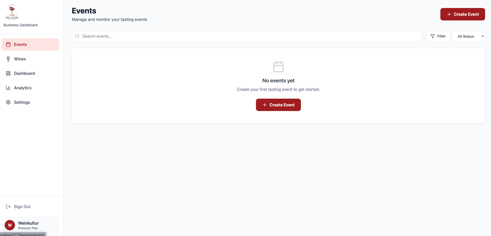 | Sophie navigates to the "Events" section. She sees her list of past and upcoming events with status badges (Published, Draft, Completed), registration progress bars, and revenue for each. She clicks "Create Event" to start a new one. |
| 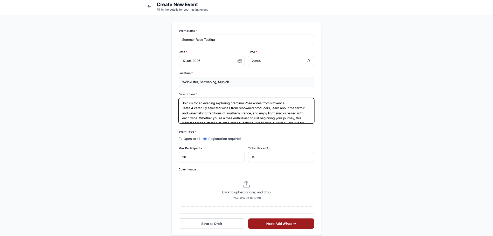 | Sophie fills out the event creation form: event name ("Summer Rosé Tasting"), date (June 14, 2026), time (18:00), location (pre-filled with her bar address), description, event type ("Registration required"), max participants (20), and ticket price (€15). She clicks "Next: Add Wines →." |

- **Frontend:** Event list with status badges, Create Event form with date picker, radio buttons, number inputs.
- **Backend:** POST `/api/events` — Creates Event document with status "draft". **Database: Create** Event document.

---

#### Step 4: Adding Wines to the Event

| Mockup | Description |
|--------|-------------|
|  | On the wine list management page, Sophie adds wines from her inventory to the tasting event. She sees the current wine list in a table format showing order number, wine name, type, region, and vintage with Edit and Delete action buttons. |
| 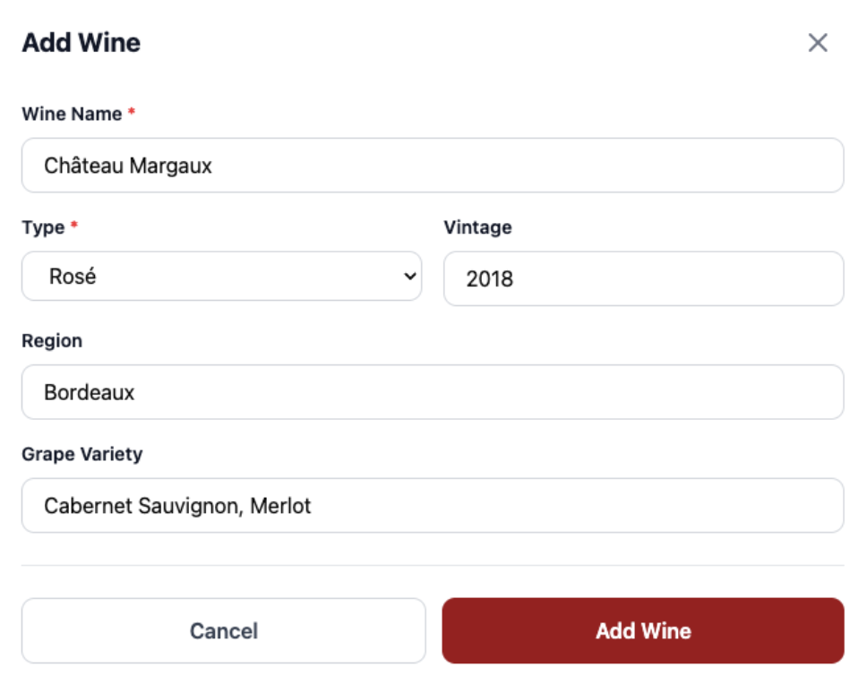 | Sophie uses the "Add Wine" button to open a modal form. She enters the wine name, selects the type (Rosé/Red/White/Sparkling), vintage year, region, and grape variety. Each wine is added to the event's tasting order. |
| 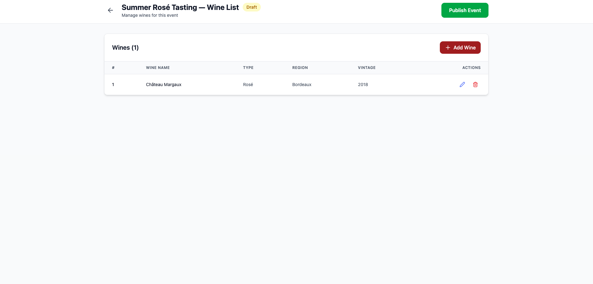 | She notices an incorrect vintage on one wine and uses the edit button to correct it. She also removes a wine that is no longer available. The table updates in real-time, demonstrating Create, Read, Update, and Delete operations on the event's wine list. |
| 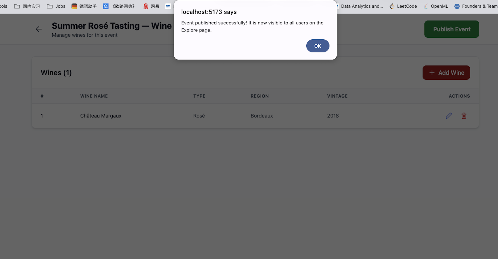 | Satisfied with her selection, Sophie clicks the green "Publish Event" button. The event status changes from "Draft" to "Published" and becomes immediately visible to all wine enthusiasts on the Explore page. |

- **Frontend:** Wine table with CRUD actions, Add/Edit modal, Publish button.
- **Backend:** POST `/api/events/:id/wines` (Create), PUT `/api/wines/:id` (Update), DELETE `/api/wines/:id` (Delete), PUT `/api/events/:id` (Update status to "published"). **Database:** Full **CRUD** on event Wine documents.

---

#### Step 5: Reviewing Event Performance & Feedback

| Mockup | Description |
|--------|-------------|
| 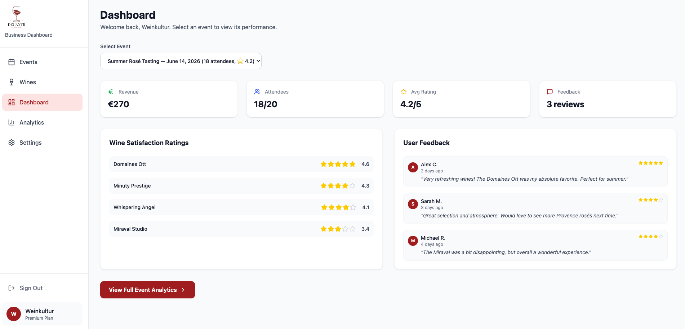 | After the event concludes, Sophie returns to her Dashboard. She selects "Summer Rosé Tasting" from the event dropdown to view its performance. She sees key metrics (revenue €270, 18/20 attendees, avg rating 4.2/5), wine satisfaction ratings displayed as star ratings sorted from highest to lowest, and real user feedback with text comments and individual star ratings. |

- **Frontend:** Event selector dropdown, stat cards, star rating list (sorted), user feedback cards with quotes.
- **Backend:** GET `/api/events/:id/analytics` — Aggregates TastingNotes: average ratings per wine, user comments. **Database: Read** TastingNotes (aggregated), Registrations.

---

#### Step 6: Business Analytics Overview

| Mockup | Description |
|--------|-------------|
| 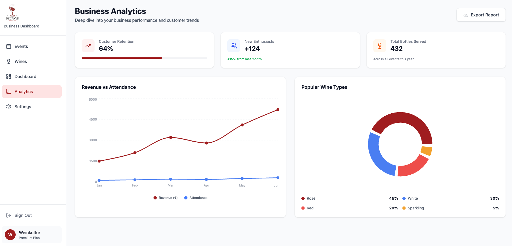 | Sophie navigates to the "Analytics" section for a holistic view across all her events. She sees customer retention (64%), new enthusiasts gained (+124), total bottles served (432), a Revenue vs Attendance trend chart over 6 months, and a Popular Wine Types pie chart showing the distribution of preferences (Rosé 45%, White 30%, Red 20%, Sparkling 5%). |

- **Frontend:** Charts (Recharts: LineChart, PieChart), metric cards with progress indicators.
- **Backend:** GET `/api/business/:id/analytics` — Cross-event aggregation of revenue, attendance, wine type preferences. **Database: Read** Events, TastingNotes, Registrations (historical aggregation).

---

### Wine Enthusiast — Alex Chen

Alex Chen is a 29-year-old software engineer who recently moved to Munich. He enjoys wine socially and attends tasting events at least once a month, mostly drinking wine when going out rather than at home. He's beginning to develop a genuine interest in understanding wine better but doesn't consider himself an expert. Alex discovers Decantr through a friend who recently attended a tasting event organized through the platform.

---

#### Step 1: Registration

| Mockup | Description |
|--------|-------------|
| 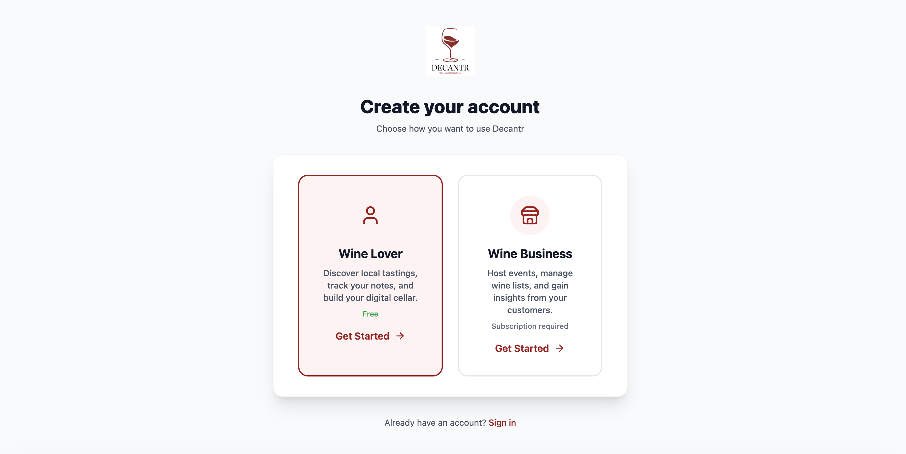 | Alex opens the Decantr website and clicks "Sign up." On the registration page, he selects "Wine Lover" (free). He is taken to a form to fill in his personal details. |
| 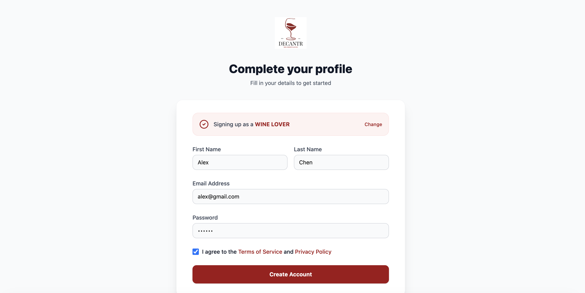 | He enters his first name, last name, email, and password. After agreeing to the terms of service, he clicks "Create Account" and is immediately directed to the Explore page. |

- **Frontend:** Registration form with role selection, form validation.
- **Backend:** POST `/api/auth/register` — Creates User with role "taster". Returns JWT token. **Database: Create** User document.

---

#### Step 2: Discovering Events

| Mockup | Description |
|--------|-------------|
| 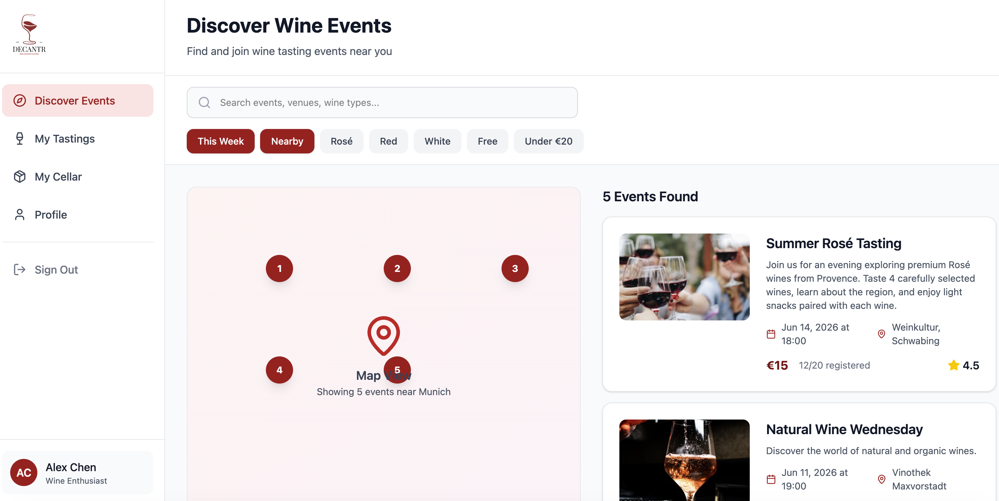 | The Explore page shows Alex an interactive map with pins marking nearby tasting events, alongside a scrollable list of upcoming events. He applies filters for "This Week" and "Nearby." He spots "Summer Rosé Tasting" at Weinkultur — €15, 12/20 registered, 4.5 stars. |

- **Frontend:** Map component with event markers, filterable event card list, search bar.
- **Backend:** GET `/api/events?status=published&location=munich` — Returns published events filtered by location and date. **Database: Read** Events, Registrations (count per event).

---

#### Step 3: Viewing Event Details

| Mockup | Description |
|--------|-------------|
| 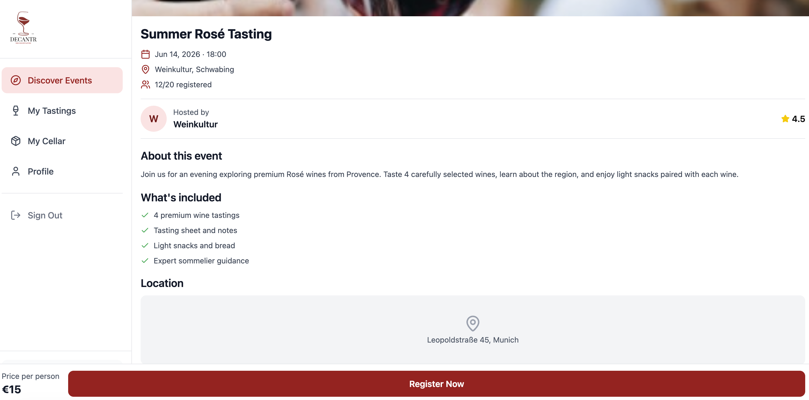 | Alex taps the event card and views the full details page: a cover image, event description promising four carefully selected Rosé wines from Provence, what's included (tastings, notes, snacks, sommelier guidance), host info ("Weinkultur" ⭐ 4.7), a location map, and €15 per person with a "Register Now" button. |

- **Frontend:** Event detail page with cover image, structured info, host section, location preview.
- **Backend:** GET `/api/events/:id` — Returns full event data including host business info and wine list. **Database: Read** Event, Business, Wine documents.

---

#### Step 4: Payment & Registration

| Mockup | Description |
|--------|-------------|
| 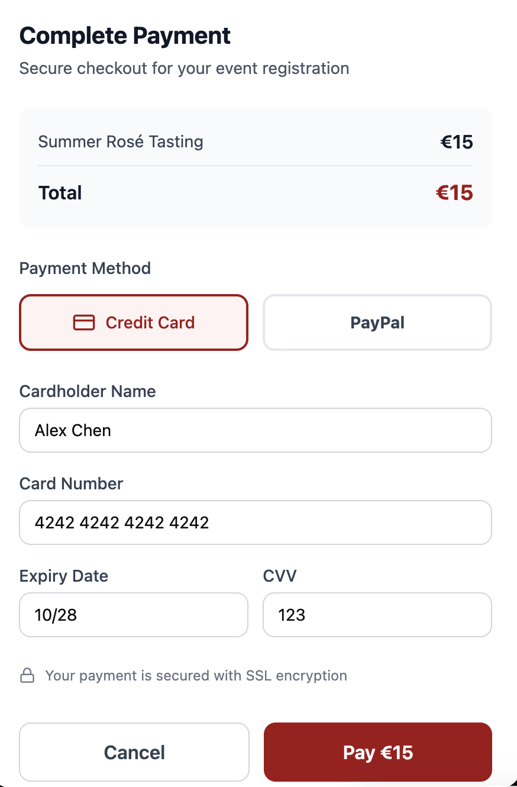 | Alex clicks "Register Now" and a payment modal appears. He sees an order summary (Summer Rosé Tasting — €15), selects "Credit Card" as payment method, and enters his card details: cardholder name, card number, expiry date, and CVV. A lock icon confirms SSL encryption. |
| 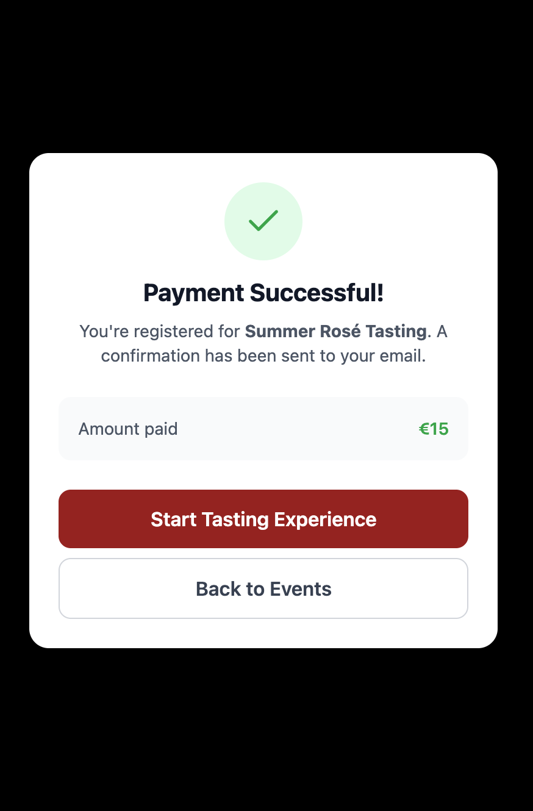 | After a brief "Processing..." animation, a green checkmark confirms "Payment Successful!" The modal shows the amount paid (€15) and gives him two options: "Start Tasting Experience" or "Back to Events." The event now appears in his My Tastings section. |

- **Frontend:** Payment modal with order summary, card form, processing animation, success confirmation.
- **Backend:** POST `/api/registrations` — Creates Registration document. Integrates with Stripe for payment processing. **Database: Create** Registration (paymentStatus: completed, paymentMethod: credit_card, amountPaid: 15).

---

#### Step 5: Attending the Tasting Event

| Mockup | Description |
|--------|-------------|
| 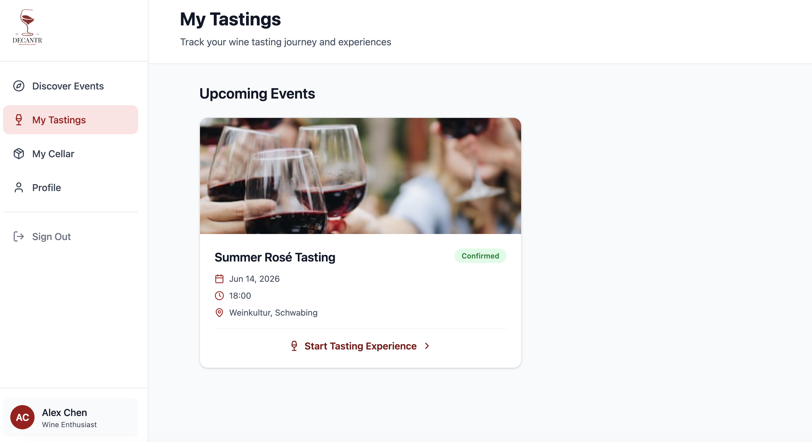 | On the evening of the event, Alex arrives at Weinkultur and opens the tasting interface. The screen shows the event name, a list of wines to taste, and a progress indicator. He begins his tasting journey through 4 wines. |
| 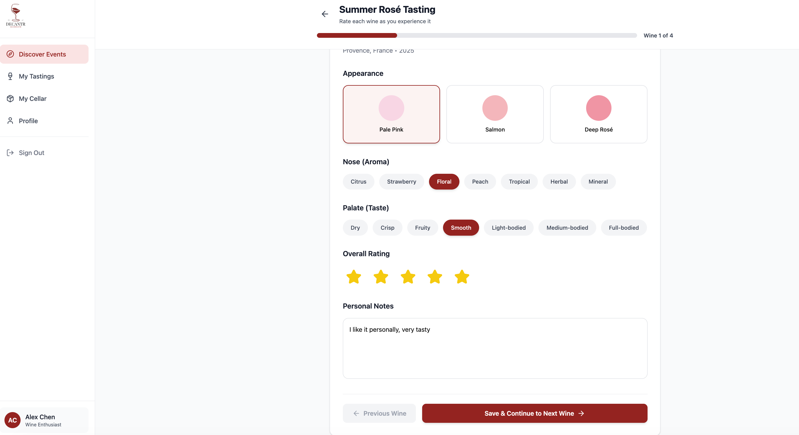 | For each wine, Alex records his impressions using a structured form: appearance (color swatch selection), nose/aroma (selectable flavor tags like Citrus, Strawberry, Floral), palate (Dry, Crisp, Light-bodied), overall star rating (1-5), and personal notes. He clicks "Save & Next Wine" to proceed. |

- **Frontend:** Step-by-step tasting form with progress bar, color selector, tag chips, star rating, text area.
- **Backend:** POST `/api/tasting-notes` — Creates a TastingNote document for each wine, linked to user, event, and wine. **Database: Create** TastingNote documents (one per wine per user).

---

#### Step 6: Post-Event Summary

| Mockup | Description |
|--------|-------------|
| 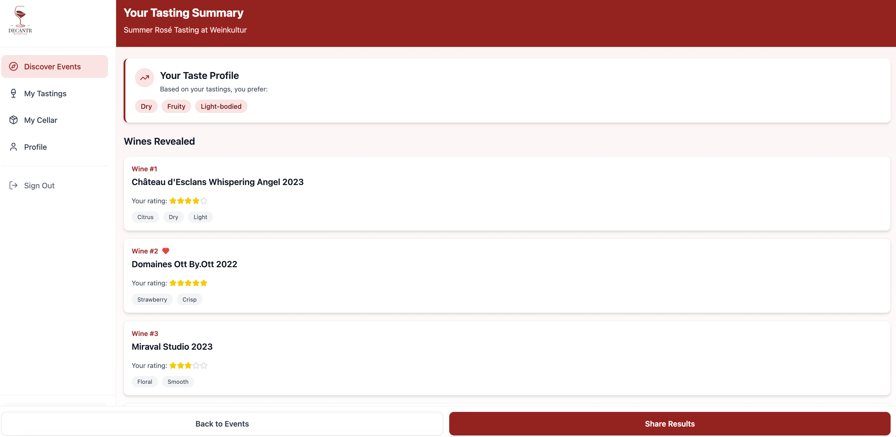 | After completing all tastings, Alex receives his personal summary. The wines are revealed with their actual names alongside his ratings and flavor tags. A taste profile insight tells him: "Based on your tastings, you prefer Dry, Fruity, Light-bodied wines." A banner prompts him to save his favorites to his wine cellar. |

- **Frontend:** Summary view with wine reveal cards, star ratings, taste profile insight, save-to-cellar prompt.
- **Backend:** GET `/api/users/:id/tasting-summary?eventId=...` — Retrieves tasting notes, reveals wine names, computes taste profile. **Database: Read** TastingNotes (by user + event), Wines (names revealed).

---

#### Step 7: Wine Journal & Cellar

| Mockup | Description |
|--------|-------------|
| 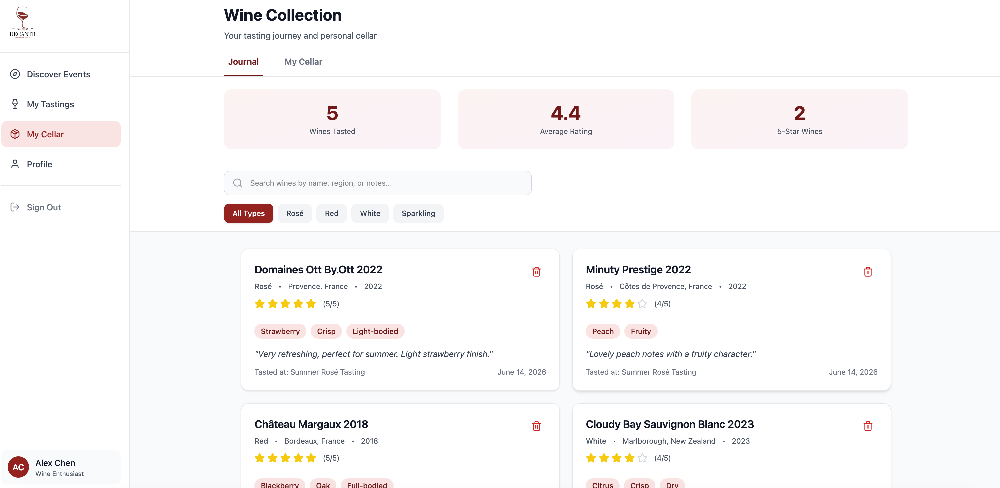 | Later that week, Alex opens "My Cellar" and navigates to the "Journal" tab. He sees all wines he's tasted, complete with his ratings, flavor tags, personal notes, and the event where he tasted them. Statistics at the top show total wines tasted (5), average rating (4.4), and 5-star wines (2). |
| 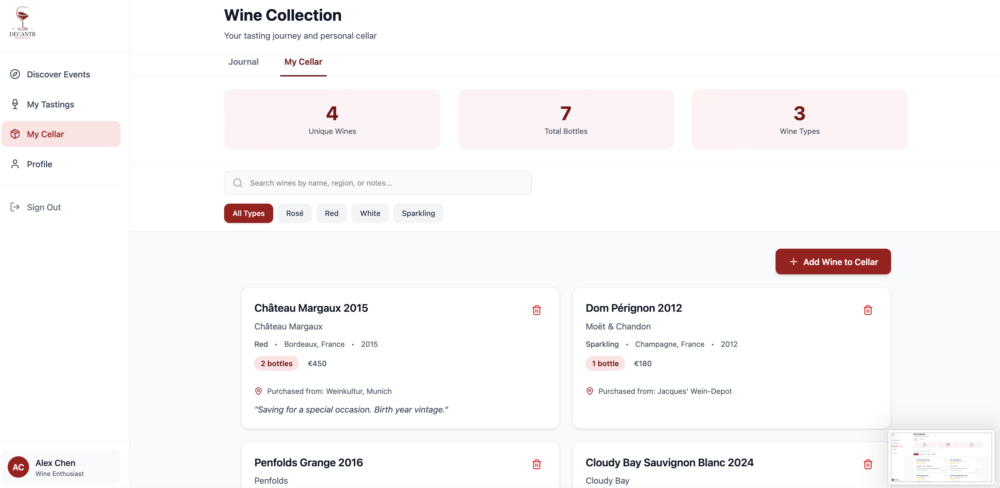 | In the "My Cellar" tab, Alex can view wines he's purchased or saved — with producer info, bottle count, purchase location, and price. This becomes his personal wine collection tracker, growing with each event he attends. |

- **Frontend:** Journal tab with wine cards (rating, tags, notes), Cellar tab with owned bottles, statistics, search/filter.
- **Backend:** POST `/api/cellar` — Creates CellarEntry documents. GET `/api/users/:id/cellar` — Retrieves all entries. **Database: Create** CellarEntry documents. **Read** CellarEntries + Wines + TastingNotes.

---

## UML Class Diagram

[INSERT UML CLASS DIAGRAM HERE — 1 full page]

This UML class diagram represents Decantr's conceptual data model. The central class is **User**, specialized into Wine Enthusiast (B2C) and Business (B2B).

**Business** → owns Business entity → creates Events → features Wines
**Wine Enthusiast** → creates Registrations (with payment) → records TastingNotes → saves CellarEntries

**Key Enumerations:**
- `UserRole`: Taster, Business
- `EventStatus`: Draft, Published, Ongoing, Completed, Cancelled
- `WineType`: Red, White, Rosé, Sparkling, Dessert
- `BusinessType`: Wine Bar, Winery, Event Organizer, Wine Shop
- `PaymentStatus`: Pending, Completed, Failed, Refunded
- `PaymentMethod`: Credit Card, PayPal
- `SubscriptionTier`: Basic, Premium
- `EventType`: Open, Registration Required

**Key Relationships:**
- User (Business) owns one Business (1:1)
- Business hosts many Events (1:*)
- Event features many Wines (1:*)
- User (Enthusiast) has many Registrations (1:*)
- Registration linked to one Event (*:1)
- User (Enthusiast) creates many TastingNotes (1:*)
- TastingNote references one Wine and one Event
- User (Enthusiast) has many CellarEntries (1:*)
- CellarEntry references one Wine
- Business has one Subscription (1:0..1)